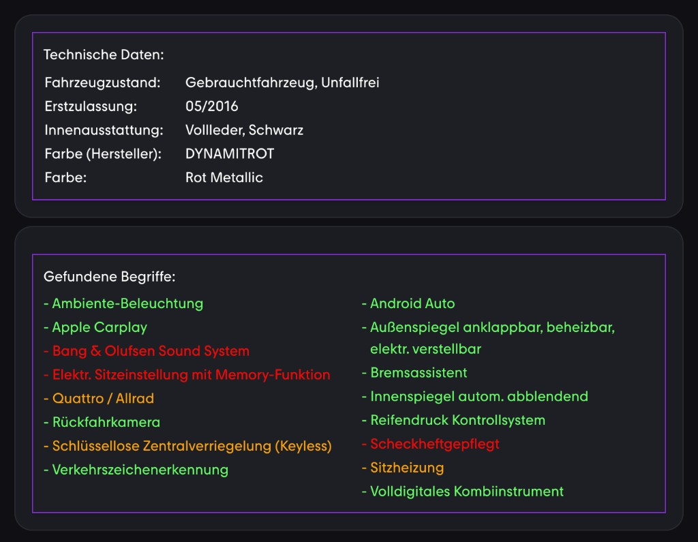
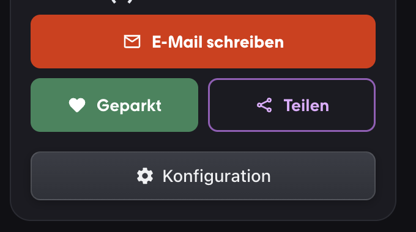
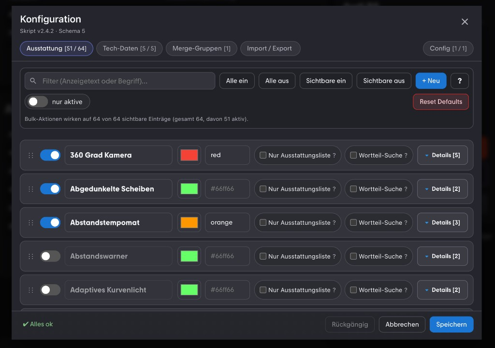
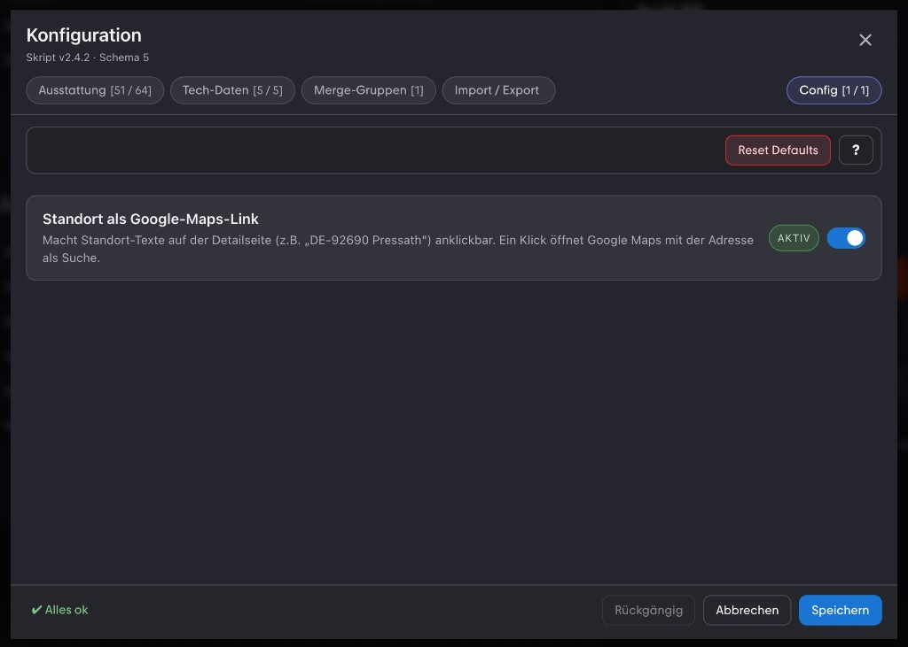

# Mobile.de Ausstattungssuche mit Popup & Import/Export

Tampermonkey-Skript für **mobile.de**-Fahrzeugdetailseiten: definierte **Ausstattungsbegriffe** und ausgewählte **Technische Daten** werden automatisch aus der Seite gewonnen, farbig dargestellt und über ein **Konfigurations-Popup** verwaltbar. Konfigurationen lassen sich per **Import/Export (JSON)** sichern oder teilen.

## Funktionen

- Token-basierte Suche mit Wortgrenzen, optional **„Nur Ausstattungsliste“** und **„Wortteil-Suche“**.
- Kombination angezeigter Treffer („Merge-Gruppen“, z.&nbsp;B. Außenspiegel-Zusammenfassung).
- Zusätzliche **Tech-Daten**-Zeilen im Ergebnisbereich.
- **SPA-tauglich** (Observer + gedrosseltes Nachladen nach DOM-/URL-Wechsel).
- Unter **Konfiguration → Config**: z.&nbsp;B. **Standort als Google-Maps-Link** (PLZ/Stadt klickbar).
- Popup mit Filter, Bulk-Aktionen, Drag-and-Drop, Undo, Hilfe-Tabs und Validierungshinweisen.

## Installation

1. [Tampermonkey](https://www.tampermonkey.net/) (oder kompatibles Userscript-Manager-Add-on) installieren.
2. Skriptdatei [`mobile-ausstattungssuche.js`](https://raw.githubusercontent.com/jxnxtxan/Mobile/main/mobile-ausstattungssuche.js) in Tampermonkey öffnen bzw. per „Neues Userscript aus URL …“ einbinden (`@updateURL` / `@downloadURL` zeigen darauf).

## Screenshots

### Ergebnis auf der Detailseite

Über dem Aktionsbereich erscheinen der Block **„Technische Daten:“** und **„Gefundene Begriffe:“** mit farblicher Zuordnung (z.&nbsp;B. Ampel-/Prioritätsfarben wie im Skript eingestellt).

### Aktionsbereich mit Konfigurations-Button

Der Button **Konfiguration** sitzt zusammen mit „E-Mail schreiben“, „Geparkt“ und „Teilen“ im typischen Aktionsbereich auf der rechten Spalte.

### Popup: Ausstattung & weitere Tabs

Filter, Schalter für jeden Eintrag, Farbwahl (Hex oder Schlüsselwort), Optionen „Nur Ausstattungsliste“ / „Wortteil-Suche“, aufklappbare **Details** (Suchbegriffe, Verbotene), sowie Tabs für Tech-Daten, Merge-Gruppen, Import/Export und einen Config-Tab.

### Popup: Config (Google Maps)

Im Tab **Config** lassen sich erweiterbare Feature-Flags umschalten, z.&nbsp;B. anklickbare Standortzeilen (**Google Maps**).

## Suchkriterien anpassen

1. Auf der Detailseite **Konfiguration** öffnen.
2. Unter **Ausstattung** Begriffe, Anzeigetext und Optionen pflegen oder **Tech-Daten**, **Merge-Gruppen** und **Import/Export** nutzen.
3. Mit **Speichern** dauerhaft in Tampermonkey-Speicher schreiben; **Abbrechen** verwirft Änderungen im aktuellen Dialog.

## Import / Export

- **Export:** Im Popup **Export aktualisieren** – JSON ablegen oder kopieren.
- **Import:** JSON ins Feld einfügen und **Import durchführen** bestätigen.
